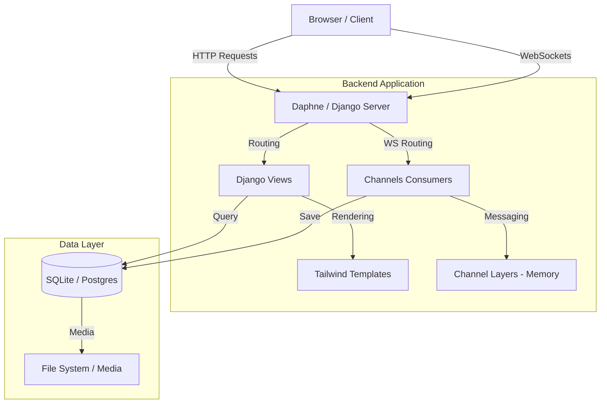

# Upstart 🛒

[](https://www.djangoproject.com/)
[](https://www.python.org/)
[](https://tailwindcss.com/)
[](https://www.sqlite.org/)

**Upstart** is a high-performance, modern marketplace platform designed to bridge the gap between buyers and sellers. Built with a robust Django backend and a sleek, responsive Tailwind CSS frontend, Upstart provides a seamless experience for listing, discovering, and trading products.

---

## 🚀 Key Features

### 🔐 Multi-Channel Authentication
- **Secure Native Auth**: Traditional email/password registration with Django's secure hashing.
- **OAuth Integration**: Simplified onboarding via Google (powered by `django-allauth`).

### 📦 Dynamic Marketplace
- **Intuitive Discovery**: Browse products by categories or search globally.
- **Product Lifecycle**: Full CRUD capabilities for sellers to manage their inventory.
- **Rich Media**: Dedicated image handling for high-quality product showcases.

### 💬 Real-time Communication (New!)
- **Instant Messaging**: Real-time buyer-seller chat powered by **Django Channels** and **WebSockets**.
- **Live Notifications**: Immediate updates when a new message arrives in your inbox.

### 🎨 Premium UI/UX
- **Modern Design**: Glassmorphism effects, smooth transitions, and brand-consistent gradients.
- **Fully Responsive**: Optimized for every device, from mobile phones to ultra-wide monitors.

---

## 🏗️ Architectural Design



---

## 🛠️ Tech Stack

- **Backend**: Python 3.x, Django 5.x
- **Frontend**: Tailwind CSS, Vanilla JavaScript, Django Templates
- **Real-time**: Django Channels 4.x, Daphne ASGI
- **Database**: SQLite (Development), PostgreSQL (Production Ready)
- **Auth**: Django-allauth (Social Account Support)

---

## ⚙️ Installation & Setup

### Prerequisites
- Python 3.10+
- pip (Python package manager)

### Quick Start

1. **Clone the Repository**
   ```bash
   git clone <repository-url>
   cd upstart
   ```

2. **Initialize Virtual Environment**
   ```bash
   python -m venv venv
   source venv/bin/activate  # Windows: venv\Scripts\activate
   ```

3. **Install Dependencies**
   ```bash
   pip install -r requirements.txt
   ```

4. **Configure Environment Variables**
   Create a `.env` file in the same directory as `manage.py`:
   ```env
   DEBUG=True
   SECRET_KEY=your-django-secret-key
   EMAIL_HOST_USER=your-email@gmail.com
   EMAIL_HOST_PASSWORD=your-app-password
   ```

5. **Apply Migrations**
   ```bash
   python manage.py migrate
   ```

6. **Launch Development Server**
   ```bash
   python manage.py runserver
   ```
   *Note: Using `runserver` with `daphne` in `INSTALLED_APPS` automatically enables WebSocket support.*

---

## 📈 Roadmap

- [ ] **Phase 1**: Advanced Filtering (Price range, Location-based search).
- [ ] **Phase 2**: Payment Gateway Integration (Stripe/PayPal).
- [ ] **Phase 3**: AI-Powered Product Recommendations.
- [ ] **Phase 4**: Native Mobile Application (React Native/Flutter).

---

## 🤝 Contribution

Contributions are welcome! Please follow these steps:
1. Fork the Project.
2. Create your Feature Branch (`git checkout -b feature/AmazingFeature`).
3. Commit your Changes (`git commit -m 'Add some AmazingFeature'`).
4. Push to the Branch (`git push origin feature/AmazingFeature`).
5. Open a Pull Request.

---

**Built with Hammer and Tails🛠️**
